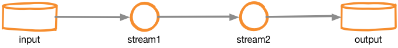
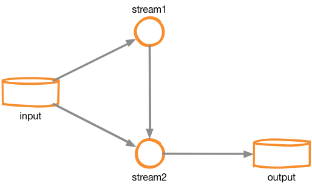
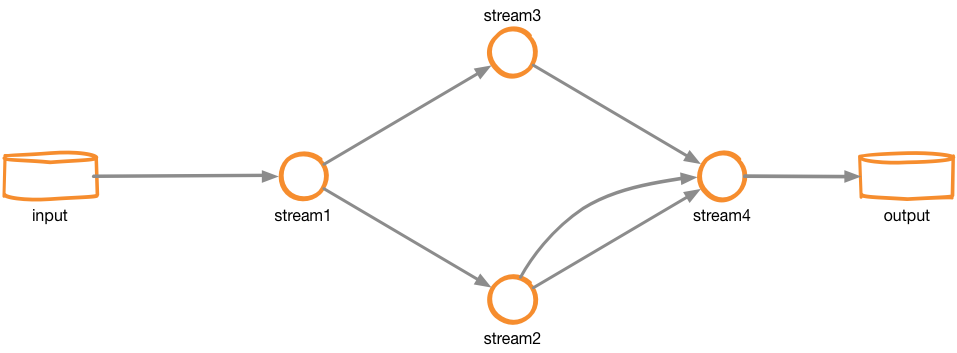
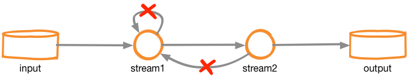

Normalizer uses [Kafka Stream](https://kafka.apache.org/documentation/streams/) to build the topology path of normalizer's streams. Kafka Streams allows us to implement and create functions, filters, and sinks to handle the data information.

For example, if you send the next stream to normalizer:

```json
{
  "inputs":{
    "input":["stream1"]
  },
  "streams": {
    "stream1": {
        "funcs": [],
        "sinks": [
            {
                "sink": "stream2", "type": "stream"
            }
        ]
    },
    "stream2": {
        "funcs": [],
        "sinks": [
            {
                "sink": "output", "type": "kafka"
            }
        ]
    }
  }
}
```

Internally the normalizer will build next topology path in Kafka Streams:



## Allowed Topology Path

Given the nature of Kafka Streams, in addition to the previous example, the normalizer currently allows next topology path:

Topology path between streams:

```json
{
  "inputs":{
    "input":["stream1", "stream2"]
  },
  "streams": {
    "stream1": {
        "funcs": [],
        "sinks": [
            {
                "sink": "stream2", "type": "stream"
            }
        ]
    },
    "stream2": {
        "funcs": [],
        "sinks": [
            {
                "sink": "output", "type": "kafka"
            }
        ]
    }
  }
}
```
With the next result:



Topology path to streams:

```json
{
  "inputs":{
    "input":["stream1"]
  },
  "streams": {
    "stream1": {
        "funcs": [],
        "sinks": [
            {
                "sink": "stream2", "type": "stream"
            },
            {
                "sink": "stream3", "type": "stream"
            }
        ]
    },
    "stream2": {
        "funcs": [],
        "sinks": [
            {
                "sink": "stream4", "type": "stream", "filter": { ··· }
            },
            {
                "sink": "stream4", "type": "stream", "filter": { ··· }
            }
        ]
    },
    "stream3": {
        "funcs": [],
        "sinks": [
            {
                "sink": "stream4", "type": "stream"
            }
        ]
    },
    "stream4": {
            "funcs": [],
            "sinks": [
                {
                    "sink": "output", "type": "kafka"
                }
            ]
    }
  }
}
```

With the next result:



As you can observe you can create topology path between streams if the distance between there is one hop.

## Not Allowed Topology Path

Normalizer cannot create the next topology paths:



If you try to create a loop between streams, normalizer will throw a `TryToDoLoopException`.